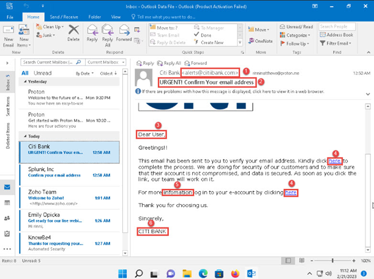
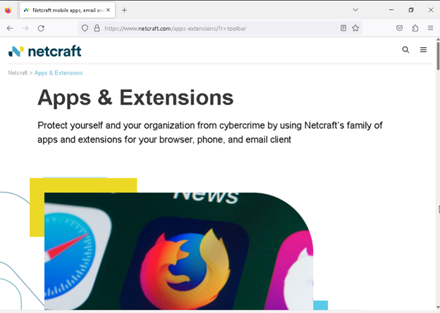
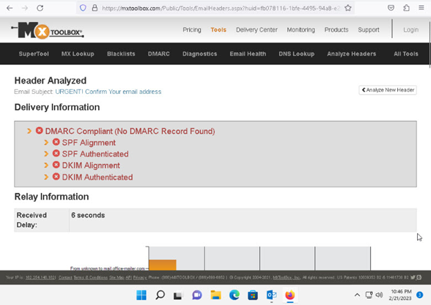

# Email Phishing Incident Handling Project

## Overview
This project demonstrates my **hands-on experience** with handling phishing email incidents. It showcases my ability to identify, analyze, contain, and eradicate phishing threats using **industry-standard tools** and **real-world practices** through **EC-Council Cybersecurity Coursework**.

## Tools Used:

- **URLscan.io**: A tool for analyzing the activity of websites by recording the domains, IP addresses, and HTTP transactions involved when a URL is accessed.
  
- **Hunter.io**: Used to verify the legitimacy of email addresses and domains. Helps identify if an email address is valid or linked to a malicious source.
  
- **AbuseIPDB**: A service for tracking **IP addresses** associated with abusive behavior. Helps identify if an email’s IP address is linked to phishing or other malicious activities.
  
- **IP2Location**: A geolocation service to track the physical location of an **IP address**. Useful for identifying suspicious locations of phishing emails.
  
- **MxToolbox**: A tool for analyzing email headers and checking **SPF** and **DKIM** records. Helps identify spoofed emails by checking email authentication methods.

- **PhishTank**: A community-driven phishing site database used to verify whether a suspicious URL is part of a known phishing campaign.

- **Netcraft**: A website reputation and security analysis tool. Helps in detecting phishing sites by analyzing the website's hosting and domain reputation.

- **RMail**: A tool for **email encryption** and **proof of delivery**. While not directly related to phishing detection, **RMail** helps secure email communications and ensures sensitive information is protected.

## Steps to Handle a Phishing Incident:
1. **Identify Phishing Signs**: Look for mismatched sender addresses, suspicious URLs, or generic greetings.
2. **Analyze URLs**: Use **Netcraft** and **PhishTank** to verify the URLs.
3. **Analyze Email Headers**: Use **MxToolbox** to check for SPF and DKIM failures.
4. **Contain the Threat**: Isolate the affected system, block malicious links, and report the phishing incident.
5. **Eradicate the Threat**: Educate the user and prevent future phishing attacks by implementing email security best practices.

## Screenshots

Here are some **screenshots** that showcase the process of analyzing a phishing email:

- **Phishing Email Example**:
  

- **Netcraft URL Analysis**:
  

  - **PhishTank Analysis**:
  

- **MxToolbox Email Header Analysis**:
  

## Future Work:
- Automate phishing detection with Python scripts.
- Implement real-time phishing alerts for email clients.

